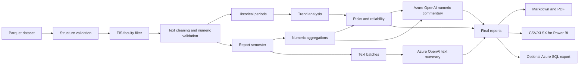

# Student Survey Analytics Pipeline - Final FIS School Jupyter

**Local processing, trend analysis, and automated reporting of student surveys with the school Azure OpenAI API**


---

## Table of Contents

- [Project Overview](#project-overview)
- [Goal and Research Context](#goal-and-research-context)
- [Main Features](#main-features)
- [Differences from the Main Pipeline](#differences-from-the-main-pipeline)
- [Pipeline Architecture](#pipeline-architecture)
- [Project Structure](#project-structure)
- [Requirements](#requirements)
- [Azure OpenAI Configuration](#azure-openai-configuration)
- [Running the Pipeline](#running-the-pipeline)
- [Testing and Production Mode](#testing-and-production-mode)
- [Analysis Methodology](#analysis-methodology)
- [Output Reports](#output-reports)
- [Optional Azure SQL Export](#optional-azure-sql-export)
- [Data Protection and Responsible AI Use](#data-protection-and-responsible-ai-use)
- [Limitations](#limitations)
- [Common Errors](#common-errors)
- [Reproducibility and Recommended Workflow](#reproducibility-and-recommended-workflow)
- [Academic Use](#academic-use)

---

## Project Overview

This document describes the notebook [`upravena_pipeline_final.ipynb`](upravena_pipeline_final.ipynb).

The notebook is based on the main analytics pipeline described in [`README.md`](README.md), but it has been adapted for the school Jupyter server and the school Azure OpenAI API. Data processing, trend calculations, risk indicators, and exports remain local and reproducible. Azure OpenAI is used only inside the `call_gpt` function to generate narrative summaries from prepared inputs.

This final variant focuses on all courses belonging to the FIS faculty. The notebook automatically selects courses using `fakulta_predmetu = 40`, creates reports for courses with a sufficient number of numeric responses, and prepares tables for Power BI.

Main outputs:

- separate Markdown and PDF reports for included FIS courses,
- numeric statistics, trends, and risk indicators,
- text summaries generated through the school Azure OpenAI deployment,
- CSV and XLSX exports prepared for Power BI,
- optional export of aggregate tables to Azure SQL.

> **Methodological principle:** The generative model does not calculate trends, averages, or risk indicators. These values are produced deterministically in the local part of the pipeline; the model uses them only as input for Czech narrative summaries.

---

## Goal and Research Context

Student surveys contain two types of information:

1. **Numeric ratings**, which allow comparisons across courses, semesters, and teachers.
2. **Text responses**, which provide context and explain recurring student experiences.

An average score alone is often not enough to interpret teaching quality. The pipeline therefore combines:

- data validation and cleaning,
- historical context,
- sample size,
- local risk detection,
- narrative summarization of prepared inputs.

The goal of the final FIS variant is to make the same analytical workflow runnable on the school Jupyter server, where using a `.env` file may not be possible. For that reason, the Azure OpenAI configuration is set directly in the first notebook cell using `os.environ`.

---

## Main Features

### Data Processing and Validation

- loading the source Parquet dataset,
- checking expected columns,
- normalizing text and numeric values,
- removing empty values and technical placeholders,
- validating numeric ratings on the `1-4` scale,
- separating text and numeric responses,
- aggregate data quality reports.

### Analytics Layer

- selecting all courses belonging to the FIS faculty (`fakulta_predmetu = 40`),
- statistics by course, question, teacher, and semester,
- selecting the report semester `LS 2024/2025`,
- comparison with the previous period,
- comparison with the historical average,
- comparison with the average of the last three previous semesters,
- classification of trend direction and reliability,
- detection of low scores, sharp drops, high variability, and repeated negative motifs.

### Generative Summaries

- summaries of text responses for the report semester,
- commentary on numeric results and trends,
- teacher comparison,
- Czech explanation of potential risks and data limitations,
- calls to the school Azure OpenAI deployment `gpt-5-mini-4`.

### Outputs

- Markdown report for each included course,
- PDF report for each included course,
- CSV and XLSX tables for Power BI,
- human-readable text columns and technical values for filtering,
- optional export of aggregate data to Azure SQL.

---

## Pipeline Architecture



### Responsibility Split

| Layer | Responsibility |
|---|---|
| Local preprocessing | Data loading, cleaning, validation, FIS faculty filtering |
| Local analytics | Aggregations, trends, risks, reliability |
| Azure OpenAI | Narrative summarization of prepared inputs |
| Reporting layer | Markdown, PDF, CSV/XLSX, and optional SQL export |

---

## Project Structure

The structure below represents the project organization used on the university-managed Jupyter server during development and testing.

```text
📁 datovy_projekt/
├── upravena_pipeline_final.ipynb                # Final FIS variant for Azure OpenAI
├── dataset_4_sentiment.parquet                # Source student survey dataset
├── 📁 generated_reports/
│   └── 📁 fis/
│       └── 📁 <report_period>/                   # Markdown and PDF reports
├── 📁 powerbi_sql_preview/
│   └── 📁 fis/
│       └── 📁 batch_<date>/                      # CSV/XLSX Power BI preview
├── README.md                                  # General 

```

---

## Requirements

The notebook expects:

- a school Jupyter server with a Python kernel,
- the `dataset_4_sentiment.parquet` file in the same directory as the notebook,
- the `pandas`, `numpy`, `requests`, `pyarrow`, and `reportlab` libraries,
- a school Azure OpenAI API key,
- a working Azure OpenAI deployment named `gpt-5-mini-4`.

The notebook contains an installation cell:

```python
%pip install pyarrow
%pip install reportlab
```

For XLSX export, `openpyxl` may also be required. For optional Azure SQL export, `sqlalchemy`, `pyodbc`, and ODBC Driver 18 for SQL Server are required.

---

## Azure OpenAI Configuration

The final FIS variant does not use `.env`. The configuration is placed directly in the first notebook cell:

```python
import os

os.environ["AZURE_API_URL"] = "https://krot0-mh4m0n6c-swedencentral.openai.azure.com/openai/deployments/gpt-5-mini-4/chat/completions?api-version=2025-01-01-preview"
os.environ["AZURE_API_KEY"] = "SCHOOL_AZURE_KEY_GOES_HERE"
os.environ["AZURE_OPENAI_MODEL"] = "gpt-5-mini"
os.environ["OFFLINE_GPT"] = "0"

print("OFFLINE_GPT:", os.environ["OFFLINE_GPT"])
print("API KEY EXISTS:", bool(os.environ.get("AZURE_API_KEY")))
print("URL:", os.environ["AZURE_API_URL"])
```

The important part is that Azure OpenAI calls a concrete deployment in the URL:

```text
/openai/deployments/gpt-5-mini-4/chat/completions
```

Changing only `AZURE_OPENAI_MODEL` is not enough. If the school deploys a different model or deployment, the part of the URL after `/deployments/` must be changed as well.

---

## Running the Pipeline

### 1. Prepare Files

Upload the following files to the working directory on the school Jupyter server:

```text
upravena_pipeline_final.ipynb
dataset_4_sentiment.parquet
```

### 2. Open the Notebook

Open:

```text
upravena_pipeline_final.ipynb
```

### 3. Configure Azure OpenAI

In the first cell, check:

```python
os.environ["AZURE_API_KEY"] = "..."
os.environ["OFFLINE_GPT"] = "0"
```

The first cell must run before the cell that defines `call_gpt`.

Expected diagnostic output:

```text
OFFLINE_GPT: 0
API KEY EXISTS: True
URL: https://...
```

### 4. Run the Cells

Run the notebook cells sequentially from the beginning. If the installation cell installs libraries and later imports still fail, restart the kernel and run the notebook again from the first cell.

---

## Testing and Production Mode

This variant is configured as a production-style run for the whole FIS faculty:

```python
TARGET_FACULTY_CODE = 40
TARGET_FACULTY_LABEL = "FIS"
selected_obdobi = None
report_obdobi = "LS 2024/2025"
REPORT_MIN_RESPONSE_COUNT = 10
EXPORT_SQL_PREVIEW_FILES = True
EXPORT_TO_SQL = False
```

### Online Mode

```python
os.environ["OFFLINE_GPT"] = "0"
```

In online mode, the school Azure OpenAI API is called and real GPT summaries are generated.

### Offline Mode

```python
os.environ["OFFLINE_GPT"] = "1"
```

In offline mode, the API is not called. The `call_gpt` function returns a test placeholder, while local calculations, report structure, and exports remain testable.

### Important Configuration Settings

| Variable | Meaning | Default value |
|---|---|---|
| `TARGET_FACULTY_CODE` | Faculty code used for filtering courses | `40` |
| `TARGET_FACULTY_LABEL` | Human-readable faculty label used in outputs | `FIS` |
| `selected_obdobi` | Historical window for trend analysis | `None` = all available periods |
| `report_obdobi` | Semester for detailed GPT summaries and reports | `LS 2024/2025` |
| `REPORT_MIN_RESPONSE_COUNT` | Minimum numeric responses required for course inclusion | `10` |
| `EXPORT_SQL_PREVIEW_FILES` | Save CSV/XLSX preview tables | `True` |
| `EXPORT_TO_SQL` | Direct export to Azure SQL | `False` |
| `SQL_PREVIEW_DIR` | Directory for Power BI preview | `powerbi_sql_preview/fis` |
| `AZURE_OPENAI_MODEL` | Descriptive model name used by the wrapper | `gpt-5-mini` |
| `OFFLINE_GPT` | Toggle for real API calls | `0` |

The notebook is not configured as a single-course mode. It processes all FIS courses that meet the minimum response threshold.

---

## Analysis Methodology

### Numeric Ratings

Numeric ratings are validated on the expected `1-4` scale. The pipeline calculates mainly:

- response count,
- mean,
- median,
- standard deviation,
- minimum and maximum.

Trend analysis compares the report semester with the previous period, the historical average, and the moving average of recent previous semesters. Outputs are complemented with trend direction and reliability warnings.

### Text Responses

Text responses are cleaned locally. The pipeline removes mainly:

- empty values,
- technical `NULL` values,
- symbolic placeholders,
- known filler strings,
- responses without meaningful letters.

Cleaned texts for the report semester are sent to Azure OpenAI only as part of summarization prompts.

### Risk Indicators

The pipeline marks potential risks, for example:

- low average rating,
- sharp drop compared with the previous semester,
- drop compared with the historical average,
- repeated deterioration,
- high response variability,
- large differences between teachers,
- repeated negative text motifs.

Indicators are analytical warnings, not automatic proof of a problem. They must be interpreted together with sample size, course history, and teaching context.

---

## Output Reports

### Markdown and PDF

Reports are saved to:

```text
generated_reports/fis/<report_period>/
```

For each included course, the pipeline creates:

```text
<course_code>_<period>_historie.md
<course_code>_<period>_historie.pdf
```

Each report contains:

1. numeric results overview,
2. trend context,
3. summary of text responses,
4. teacher comparison,
5. teacher trend,
6. potential risks and warnings about limited data reliability.

### Power BI and CSV/XLSX Export

Local preview files are saved to:

```text
powerbi_sql_preview/fis/batch_<date>/
```

| Table | Content |
|---|---|
| `anketa_dim_course` | Course dimension |
| `anketa_dim_period` | Semester dimension and period ordering |
| `anketa_course_reports` | Report metadata and paths to MD/PDF files |
| `anketa_course_summary` | Course summaries, trends, and text outputs |
| `anketa_teacher_summary` | Aggregated teacher results and trends |
| `anketa_risk_flags` | Technical and human-readable risk indicators |
| `anketa_negative_motifs` | Aggregated negative motifs |
| `anketa_reliability_warnings` | Data reliability limitations and warnings |

The `anketa_course_summary` table contains human-readable text columns suitable for Power BI:

- `summary_numeric`,
- `course_trend_text`,
- `summary_text`,
- `teacher_comparison_text`,
- `teacher_trend_text`,
- `potential_risks_text`,
- `data_reliability_warnings_text`,
- `full_report_text`.

---

## Optional Azure SQL Export

Direct SQL export is disabled by default:

```python
EXPORT_TO_SQL = False
```

To enable it:

```python
EXPORT_TO_SQL = True
```

The following SQL environment variables must also be available:

```bash
AZURE_SQL_SERVER="..."
AZURE_SQL_DATABASE="..."
AZURE_SQL_USERNAME="..."
AZURE_SQL_PASSWORD="..."
AZURE_SQL_DRIVER="ODBC Driver 18 for SQL Server"
```

SQL export sends only aggregate and report tables. Raw student text responses are not exported as a separate SQL table.

---

## Data Protection and Responsible AI Use

The project works with sensitive evaluation data. When using the pipeline, institutional internal rules, personal data protection rules, and the original purpose of collecting the responses must be respected.

### Implementation Principles

- In this final FIS variant, the API key is operationally set in the first notebook cell because `.env` may not work on the school server.
- A notebook with a filled-in key must not be shared publicly.
- Before submission or publication, the key must be replaced with a placeholder.
- Raw text responses are not exported to Power BI or Azure SQL as a separate table.
- Prepared prompts with cleaned texts and aggregate inputs are sent to Azure OpenAI.
- Historical trends and risks are calculated locally.
- Generative model outputs are supportive and require human review.

Free-text responses may contain names or other personal data. Before production use, it is necessary to verify that the selected processing workflow and data transfer to Azure OpenAI comply with legal, contractual, and institutional conditions.

---

## Limitations

- Text summaries depend on the quality and representativeness of student comments.
- A low number of responses limits the reliability of conclusions.
- Courses with fewer than `REPORT_MIN_RESPONSE_COUNT` numeric responses are not included in final reports.
- Regular expressions for negative motifs cannot capture all language nuances.
- The generative model may produce inaccurate or overly strong interpretations.
- Semester-to-semester comparisons may be affected by changes in teachers, course content, teaching format, or respondent structure.
- Azure OpenAI calls depend on the availability of the school deployment `gpt-5-mini-4`.
- Because the key is stored in the first cell, notebook sharing must be controlled carefully.

---

## Common Errors

### `Run the first notebook cell to set AZURE_API_KEY`

The `call_gpt` cell was run before the first configuration cell. Run the notebook again from the first cell.

### `API KEY EXISTS: False`

The Azure API key is not filled in the first cell or it has been overwritten with an empty value. Check:

```python
os.environ["AZURE_API_KEY"] = "..."
```

### Deployment Error or 404

The most common cause is an incorrect Azure deployment name in the URL. The working school configuration uses:

```text
deployments/gpt-5-mini-4
```

If the deployment changes in the school Azure environment, update the URL in the first cell.

### `.env` Cannot Be Created

This is not a problem in this variant. The notebook does not use `.env`; it reads configuration from the first cell.

### Some Reports Were Not Created

The course probably does not have at least:

```python
REPORT_MIN_RESPONSE_COUNT = 10
```

numeric responses in the report semester.

---

## Reproducibility and Recommended Workflow

For a reproducible run, record:

1. the input dataset version,
2. the notebook execution date,
3. the value of `TARGET_FACULTY_CODE` and `TARGET_FACULTY_LABEL`,
4. the value of `report_obdobi`,
5. the value of `selected_obdobi`,
6. the Azure deployment used,
7. the state of `OFFLINE_GPT`,
8. the value of `REPORT_MIN_RESPONSE_COUNT`,
9. the generated Markdown/PDF reports,
10. the generated CSV/XLSX Power BI exports.

The notebook contains local validation checks, but in its current form it does not replace a separate automated test suite.

---

## Academic Use

The project is intended for analytical, research, and demonstration purposes in the evaluation of student surveys. The outputs can be used as input for:

- methodological validation of student surveys,
- Power BI dashboard design,
- comparison of courses and teachers over time,
- demonstration of combining statistical analysis with generative AI.

When presenting results, it is recommended to always state:

- the analyzed faculty,
- the report period,
- the number of responses,
- the pipeline version used,
- the Azure deployment used,
- data limitations,
- the fact that part of the text interpretation was generated by a generative model.


## Team & Contributors

This pipeline was developed and adapted by:

- **[@vavd01](https://github.com/vavd01)**
- **[@drahoslim](https://github.com/drahoslim)**
- **[@JanDite](https://github.com/JanDite)**
- **[@blav08](https://github.com/blav08)**
